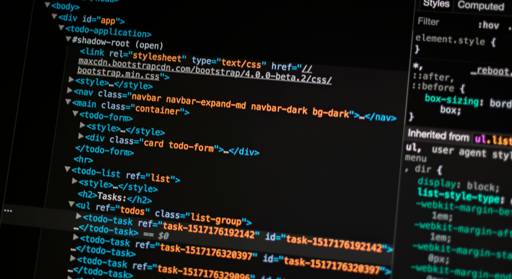

  

# 🖥️ DAM1 // 2026–2027

### **🚀 Desarrollo de Aplicaciones Multiplataforma (DAM)**

 

**`code → test → break → fix → commit → repeat`**

---

## 👋 Bienvenidos

Esta es la organización de GitHub que utilizaremos durante el curso **2026–2027** para trabajar las prácticas, proyectos y materiales de **2º de Sistemas Microinformáticos y Redes (SMR)**.

**GitHub** será una de nuestras principales herramientas de trabajo: aquí encontraréis los repositorios de las prácticas, código, documentación y otros recursos que iremos utilizando durante el curso.

La idea no es solamente aprender a programar o configurar sistemas, sino acostumbrarnos poco a poco a utilizar herramientas y metodologías similares a las que encontraréis en un entorno profesional.

---
